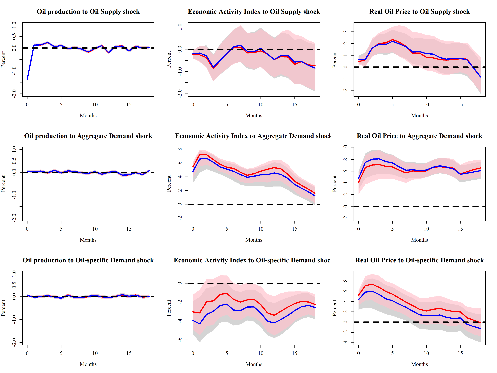

# Note: this repo is expired

please refer to the complete R package repo: https://github.com/GoldenBaozi/VARS

# Estimation and Inference of VAR with Bayesian methods

- [x] basic VAR, OLS Estimation
- [x] IRF, FEVD, HDC and plots
- [ ] identification via recursive and IV approach (will be finished on about 11.20)
- [ ] inference via bootstrap (optional, not required with bayesian method)
- [x] bayesian VAR
- [x] identification via narrative sign restrictions (Antolín-Díaz and Rubio-Ramírez, 2018) with bayesian method, if time permits
- [x] testing on examples (SW 2001, AR 2018, etc.)
- [ ] R package

The sign restriction procedure cannot be vectorized, must put it in Rcpp !!

For detailed illustration, see https://goldenbaozi.github.io/BayesVAR.html

## Progress

- Main result get.
- **Note**: must check the max root of companion matrix, to ensure the stationary of the system !!!
- I re-read AR2018's code, and now strictly follow there procedure of checking restrictions. It greatly increases running efficiency
  - first, check NR and EBR, no NSR, and only compute IRF needed (don't save it)
  - for every drawing $\alpha$ and $\Sigma$, draw another 100 $Q$ trying to match them
  - second, impose NSR
  - finally, compute IRF for `first` set and `second` set
- Now, 2000 draws takes about 45 mins (200 seconds -> 100 draws), while the original matlab code takes about 500 seconds for 100 draws.
- NSR hardly satisfied.

## Rep result

Following is figure 2 of Antolín-Díaz and Rubio-Ramírez (2018). 

- Blue line and grey shade: HDP of IRF with SR and EBR
- Red line and pink shade: HDP of IRF with SR, EBR and NSR

